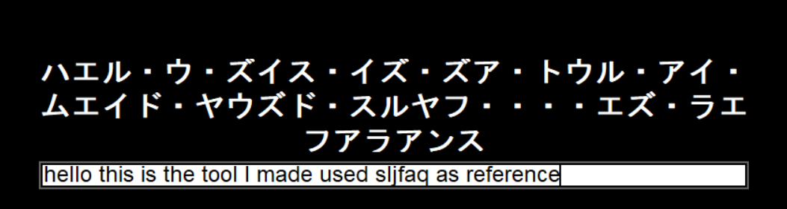

# English-to-Katakana Transliteration Overlay

Real-time overlay tool to convert English text to Katakana following SLJFAQ phonetic rules, using IPA (International Phonetic Alphabet) for accurate pronunciation mapping.

## Inspiration

This project was inspired by [this hololive clip](https://www.youtube.com/watch?v=Ro8jx8JxF9k&list=WL&index=2). Although it is more easier and accurate to do it with openai model prompt engineering, because I did not want to use money decided to go with the rule based approach.

## Features

✅ **Real-time Conversion**  
✅ **Tried to follow SLJFAQ**  
✅ **On-screen Overlay**  
✅ **Phonetic Accuracy**



## Requirements

- Python 3.13
- `tkinter`
- `eng-to-ipa` library

## Installation

```bash
pip install eng-to-ipa
```

## Credits

- [SLJFAQ English-to-Katakana Rules](https://www.sljfaq.org/afaq/english-in-japanese.html)
